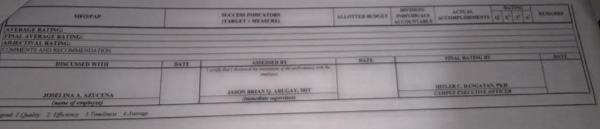
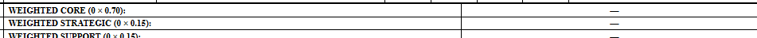
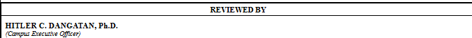

admin

- can you fix the save draft function
- it cannot submit IPCR it says

  Error
  Failed to save IPCR.

ca nyou check the print output all users if the output overlaps it should go to the next page justlike that on the image

remove this also on the print output page all users

on the admin and super admin side can you cetner the name there justlike on the staff

