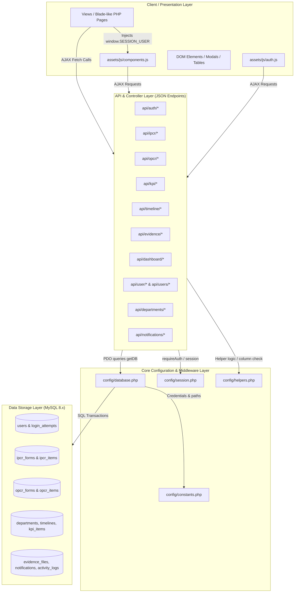
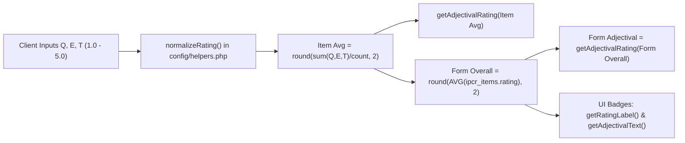

# System Memory & Full-Project Synchronization Registry (`systememory.md`)
**Automated Office Performance Commitment Rating (OPCR) & Individual Performance Commitment Rating (IPCR) Generation System**  
**Cagayan State University — Piat Campus (CSU-Piat)**

---

## 📌 The Cardinal Synchronization Directive

> [!IMPORTANT]
> **MANDATORY RULE FOR ALL DEVELOPERS & AI ASSISTANTS:**  
> Whenever you create, edit, refactor, or delete any function, API endpoint, database column, session key, or UI component in this repository, you **MUST** consult this document first.
>
> 1. **Identify the function or component you plan to modify** in the registries below.
> 2. **Trace all connected callers, consumers, database dependencies, and side effects** using the dependency matrices.
> 3. **Follow the corresponding Refactoring Playbook** (Section 8) to ensure every dependent file is updated in lockstep.
> 4. **Execute the Pre-Commit Synchronization Audit Checklist** (Section 9) before concluding your work.

---

## Table of Contents

1. [Architectural Overview & Data Flow Topology](#1-architectural-overview--data-flow-topology)
2. [Global Config & Backend Helper Functions Registry](#2-global-config--backend-helper-functions-registry)
3. [API Endpoints & Data Contracts Registry](#3-api-endpoints--data-contracts-registry)
4. [Frontend JavaScript Utilities & UI Component Registry](#4-frontend-javascript-utilities--ui-component-registry)
5. [Database Schema & Table-to-Code Mapping](#5-database-schema--table-to-code-mapping)
6. [Views & Page Directory Matrix](#6-views--page-directory-matrix)
7. [Core Business Logic & Ripple-Effect Chains](#7-core-business-logic--ripple-effect-chains)
8. [Refactoring & Synchronization Playbooks](#8-refactoring--synchronization-playbooks)
9. [Pre-Commit Synchronization Audit Checklist](#9-pre-commit-synchronization-audit-checklist)

---

## 1. Architectural Overview & Data Flow Topology

### 1.1 High-Level Architecture



### 1.2 Core Data Lifecycles

1. **Timeline Cycle**: Superadmin opens Timeline (`timelines`) $\rightarrow$ IPCR & OPCR forms check `timelines.status = 'open'` and `submission_deadline`.
2. **KPI Cycle**: Superadmin/Admin creates KPI items (`kpi_items`) with scope (`global`, `department`, `user`) $\rightarrow$ Rendered into IPCR & OPCR form dropdowns $\rightarrow$ Linked to `ipcr_items.kpi_id`.
3. **OPCR Cycle**: Department Head (Admin) drafts/submits department targets (`opcr_forms`, `opcr_items`) $\rightarrow$ Superadmin reviews, rates, approves/disapproves $\rightarrow$ Notifies Admin $\rightarrow$ Feeds reports.
4. **IPCR Cycle**: Faculty/Staff creates IPCR (`ipcr_forms`, `ipcr_items`) $\rightarrow$ Uploads evidence (`evidence_files`) $\rightarrow$ Submits $\rightarrow$ Immediate supervisor (Admin) reviews and rates Q/E/T ratings $\rightarrow$ Calculates adjectival & overall ratings $\rightarrow$ Notifies user $\rightarrow$ Aggregated in reports.

---

## 2. Global Config & Backend Helper Functions Registry

All backend functions and their downstream callers. **If you touch any of these, check every single listed caller!**

### 2.1 Database & Connection (`config/database.php`)

| Function Signature | Return Type | Responsibility | Direct Callers | Synchronization Checklist |
|---|---|---|---|---|
| `getDB(): PDO` | `PDO` | Singleton PDO instance with utf8mb4, exception errormode, and JSON error handling for API callers | Every file in `api/` (all 31 files), `config/session.php` (`addLog()`), `config/helpers.php`, `setup.php` | - If connection options change, test both web and AJAX failure modes.<br>- Ensure `DB_HOST`, `DB_NAME`, `DB_USER`, `DB_PASS` match in `config/constants.php`. |

### 2.2 Session & Auth Utilities (`config/session.php`)

| Function Signature | Return Type | Responsibility | Direct Callers | Synchronization Checklist |
|---|---|---|---|---|
| `requireAuth(array $roles = []): array` | `array` (user session) | Enforces authentication. If unauthenticated: returns 401 JSON (for API) or redirects to `index.php` (for views). If role forbidden: returns 403 JSON or redirects via `redirectByRole()`. | All views (`views/*/*.php`), all protected API endpoints (`api/ipcr/*`, `api/opcr/*`, `api/kpi/*`, etc.) | - **Critical:** Changing the return shape alters `$user['id']`, `$user['role']`, `$user['department_id']`.<br>- Must match `window.SESSION_USER` in views. |
| `getSessionUser(): ?array` | `?array` | Returns active `$_SESSION['user']` or null | View headers, navigation, profile checks | Verify session key consistency (`id`, `username`, `role`, `department_id`). |
| `setSessionUser(array $user): void` | `void` | Regenerates session ID and stores `$user` in `$_SESSION['user']` | `api/auth/login.php`, `api/user/update-profile.php` | Ensure all keys are populated: `id`, `username`, `role`, `name`, `position`, `department_id`, `department_name`, `email`, `gender`, `avatar`, `status`. |
| `clearSession(): void` | `void` | Unsets and destroys PHP session | `api/auth/logout.php` | If any custom cookies or session tokens are stored, ensure they are cleared. |
| `isLoggedIn(): bool` | `bool` | Checks if `$_SESSION['user']` exists | `index.php`, `register.php`, `forgot-password.php` (redirects logged-in users away) | Ensure non-null and valid array. |
| `redirectByRole(string $role): void` | `void` | Redirects client browser to role dashboard based on role constant | `config/session.php`, `index.php`, `register.php` | Paths must match actual view paths: `views/superadmin/dashboard.php`, `views/admin/dashboard.php`, `views/users/dashboard.php`. |
| `getBasePath(): string` | `string` | Calculates relative path offset (`../../` or empty) based on `$_SERVER['PHP_SELF']` | `config/session.php`, view redirects | Must cover any newly created subdirectories. |
| `addLog(int $userId, string $activity): void` | `void` | Silent audit logger; inserts into `activity_logs` with IP address | `api/auth/login.php`, `api/auth/logout.php`, `api/ipcr/save.php`, `api/ipcr/review.php`, `api/opcr/save.php`, `api/opcr/review.php`, `api/user/update-profile.php`, etc. | - Table: `activity_logs`.<br>- Never allow exceptions to bubble up or disrupt transactions. |
| `generateCsrfToken(): string` | `string` | Creates/returns hex CSRF token in session | Form rendering views | If CSRF enforcement is added to POST APIs, both header and session check must align. |
| `verifyCsrfToken(string $token): bool` | `bool` | Validates submitted CSRF token | Form submission endpoints | Ensure token presence in AJAX headers or payloads. |

### 2.3 Domain Helper Functions (`config/helpers.php`)

| Function Signature | Return Type | Responsibility | Direct Callers | Synchronization Checklist |
|---|---|---|---|---|
| `getImmediateSupervisor(PDO $db, ?string $departmentId): ?array` | `?array` | Queries active admin for a department, prioritizing Dean $\rightarrow$ Department Head $\rightarrow$ Office Head | `api/user/supervisor.php`, IPCR review assignment | - Returns `['name', 'position', 'designation']`.<br>- If designation ENUM changes in `users`, update SQL `ORDER BY FIELD`. |
| `normalizeRating($value): ?float` | `?float` | Clamps numeric ratings to 1.00–5.00, rounds to 2 decimals, casts values $<1$ or empty to `null` | `api/ipcr/save.php`, `api/ipcr/review.php`, `config/helpers.php` | - Must conform to database CHECK constraint `rating BETWEEN 1 AND 5`.<br>- Any change alters average computation. |
| `getAdjectivalRating($avg): string` | `string` | Converts numeric 1.0–5.0 rating to string: Outstanding ( $\ge 4.5$), Very Satisfactory ($\ge 3.5$), Satisfactory ($\ge 2.5$), Unsatisfactory ($\ge 1.5$), Poor ($>0$) | `api/ipcr/save.php`, `api/ipcr/review.php`, `api/opcr/save.php`, `assets/js/components.js` (`getAdjectivalText`) | - **Sync requirement:** PHP `getAdjectivalRating` and JS `getAdjectivalText` in `components.js` MUST use identical thresholds! |
| `ensureIpcrColumns(PDO $db): void` | `void` | Auto-migrates missing columns (`q_rating`, `e_rating`, `t_rating`, `mfo`, `target`, `budget`, `measure`) into `ipcr_items` | `api/ipcr/save.php`, `api/ipcr/review.php`, `api/ipcr/get.php` | If columns are permanently added to `schema.sql`, verify types match. Uses static caching per request. |
| `ensureOpcrColumns(PDO $db): void` | `void` | Auto-migrates missing columns (`q_rating`, `e_rating`, `t_rating`, `measure`, `remarks`, `rating DECIMAL`) into `opcr_items` | `api/opcr/save.php`, `api/opcr/review.php`, `api/opcr/get.php` | Matches decimal rating migration in `opcr_items`. |

---

## 3. API Endpoints & Data Contracts Registry

Every API endpoint in the system, its HTTP method, authorization level, input schema, response schema, and connected UI consumers.

```
Key Rule: If you change any API request field or JSON response key,
you MUST update both the PHP endpoint and ALL consumer Views listed below!
```

### 3.1 Authentication (`api/auth/`)

| Endpoint | Method | Role | Request Payload | Response Schema | Calling Files / UI Components |
|---|---|---|---|---|---|
| `login.php` | POST | Public | `{username, password}` | `{success: bool, user?: array, error?: string, locked?: bool, seconds_remaining?: int}` | `index.php`, `assets/js/auth.js` |
| `logout.php` | GET/POST | Logged-in | None | Redirects to `index.php` or returns `{success: true}` | `assets/js/components.js` (`handleLogout`), `assets/js/auth.js` (`logout`) |
| `register.php` | POST | Public | `{name, username, password, confirm_password, email, gender, department, position, security_question, security_answer}` | `{success: bool, message?: string, error?: string}` | `register.php`, `assets/js/auth.js` (`registerUser`) |
| `forgot-password.php` | POST | Public | Step 1: `{action: 'verify_username', username}`<br>Step 2: `{action: 'verify_answer', answer}` | `{success: bool, question?: string, error?: string}` | `forgot-password.php`, `assets/js/auth.js` |
| `reset-password.php` | POST | Public (Session flagged) | `{password, confirm_password}` | `{success: bool, message?: string, error?: string}` | `forgot-password.php`, `assets/js/auth.js` (`resetPassword`) |
| `change-password.php` | POST | Logged-in | `{current_password, new_password, confirm_password}` | `{success: bool, message?: string, error?: string}` | `views/*/account.php`, `assets/js/auth.js` (`changePassword`) |

### 3.2 IPCR Module (`api/ipcr/`)

| Endpoint | Method | Role | Request Payload | Response Schema | Calling Files / UI Components |
|---|---|---|---|---|---|
| `save.php` | POST | `user`, `admin` | `{action: 'draft'\|'submit', ipcr_id, timeline_id, covered_period, core: [...], strategic: [...], support: [...]}` | `{success: bool, ipcr_id: int, status: string, overall_rating: float, message: string}` | `views/users/ipcr-form.php`, `views/admin/ipcr-form.php` |
| `get.php` | GET | `user`, `admin`, `superadmin` | `?id=<ipcr_id>` | `{success: bool, form: object, items: object {core: [], strategic: [], support: []}, user: object}` | `views/users/ipcr-form.php`, `views/users/status.php`, `views/admin/review-ipcr.php`, `views/admin/accomplishments.php`, `views/superadmin/accomplishments.php` |
| `list.php` | GET | Logged-in | `?timeline_id=&status=&department_id=&user_id=` | `{success: bool, forms: array}` | `views/users/status.php`, `views/admin/review-ipcr.php`, `views/admin/reports.php`, `views/superadmin/reports.php` |
| `review.php` | POST | `admin`, `superadmin` | `{ipcr_id: int, status: 'reviewed'\|'approved'\|'disapproved', remarks: string, ratings: [{item_id, q_rating, e_rating, t_rating, rating, accomplishment?, remarks?}]}` | `{success: bool, overall_rating: float, status: string, message: string}` | `views/admin/review-ipcr.php`, `views/admin/accomplishments.php`, `views/superadmin/accomplishments.php` |

### 3.3 OPCR Module (`api/opcr/`)

| Endpoint | Method | Role | Request Payload | Response Schema | Calling Files / UI Components |
|---|---|---|---|---|---|
| `save.php` | POST | `admin`, `superadmin` | `{action: 'draft'\|'submit', opcr_id, timeline_id, covered_period, core: [...], strategic: [...], support: [...]}` | `{success: bool, opcr_id: int, status: string, overall_rating: float, message: string}` | `views/admin/set-target.php`, `views/superadmin/set-target.php` |
| `get.php` | GET | `admin`, `superadmin` | `?id=<opcr_id>` | `{success: bool, form: object, items: object {core: [], strategic: [], support: []}}` | `views/admin/set-target.php`, `views/superadmin/set-target.php`, `views/superadmin/review-opcr.php`, `views/superadmin/accomplishments.php` |
| `list.php` | GET | `admin`, `superadmin` | `?timeline_id=&department_id=&status=` | `{success: bool, forms: array}` | `views/superadmin/review-opcr.php`, `views/superadmin/accomplishments.php`, `views/admin/reports.php`, `views/superadmin/reports.php` |
| `review.php` | POST | `superadmin` | `{opcr_id: int, status: 'reviewed'\|'approved'\|'disapproved', remarks: string, ratings: [{item_id, rating, actual, remarks}]}` | `{success: bool, overall_rating: float, status: string, message: string}` | `views/superadmin/review-opcr.php`, `views/superadmin/accomplishments.php` |

### 3.4 KPI Module (`api/kpi/`)

| Endpoint | Method | Role | Request Payload | Response Schema | Calling Files / UI Components |
|---|---|---|---|---|---|
| `list.php` | GET | Logged-in | `?category=&department_id=` | `{success: bool, items: array, grouped: {core: [], strategic: [], support: []}}` | `views/users/ipcr-form.php`, `views/admin/ipcr-form.php`, `views/admin/kpi-management.php`, `views/superadmin/settings.php` |
| `save.php` | POST | `admin`, `superadmin` | `{id?, category, mfo, success_indicator, target, measure, scope, department_id?, assigned_to?}` | `{success: bool, id: int, message: string}` | `views/admin/kpi-management.php`, `views/superadmin/settings.php` |
| `get.php` | GET | Logged-in | `?id=<kpi_id>` | `{success: bool, item: object}` | `views/admin/kpi-management.php`, `views/superadmin/settings.php` |
| `delete.php` | POST | `admin`, `superadmin` | `{id: int}` | `{success: bool, message: string}` | `views/admin/kpi-management.php`, `views/superadmin/settings.php` |

### 3.5 Timeline Module (`api/timeline/`)

| Endpoint | Method | Role | Request Payload | Response Schema | Calling Files / UI Components |
|---|---|---|---|---|---|
| `list.php` | GET | Logged-in | `?status=open\|closed` | `{success: bool, timelines: array}` | All IPCR & OPCR forms, dashboards, `views/superadmin/settings.php` |
| `save.php` | POST | `superadmin` | `{id?, academic_year, semester, start_date, end_date, submission_deadline, status}` | `{success: bool, id: int, message: string}` | `views/superadmin/settings.php` |

### 3.6 Evidence Module (`api/evidence/`)

| Endpoint | Method | Role | Request Payload | Response Schema | Calling Files / UI Components |
|---|---|---|---|---|---|
| `upload.php` | POST | `user`, `admin` | `multipart/form-data`: `file`, `ipcr_form_id`, `category`, `description` | `{success: bool, file: object, message: string}` | `views/users/evidence.php`, `views/admin/evidence.php` |
| `list.php` | GET | Logged-in | `?ipcr_form_id=&user_id=` | `{success: bool, files: array}` | `views/users/evidence.php`, `views/admin/evidence.php`, `views/admin/review-ipcr.php` |
| `delete.php` | POST | `user`, `admin` | `{id: int}` | `{success: bool, message: string}` | `views/users/evidence.php`, `views/admin/evidence.php` |

### 3.7 Dashboards & Analytics (`api/dashboard/`)

| Endpoint | Method | Role | Parameters | Response Schema | Calling Files |
|---|---|---|---|---|---|
| `user-stats.php` | GET | `user` | None (reads session user) | `{success: bool, status_counts: object, latest_rating: float, recent_forms: array, active_timeline: object}` | `views/users/dashboard.php` |
| `admin-stats.php` | GET | `admin` | None (reads session department) | `{success: bool, faculty_count: int, pending_reviews: int, approved_count: int, avg_department_rating: float, status_distribution: object, rating_distribution: object}` | `views/admin/dashboard.php` |
| `superadmin-stats.php` | GET | `superadmin` | None | `{success: bool, total_users: int, total_departments: int, opcr_pending: int, ipcr_pending: int, department_summaries: array}` | `views/superadmin/dashboard.php` |

### 3.8 Users, Departments & Notifications

| Endpoint | Method | Role | Request / Params | Response Schema | Calling Files |
|---|---|---|---|---|---|
| `api/users/list.php` | GET | `superadmin`, `admin` | `?department_id=&role=&status=` | `{success: bool, users: array}` | `views/superadmin/accounts.php`, `views/admin/kpi-management.php` |
| `api/users/toggle-status.php` | POST | `superadmin` | `{user_id: int, status: 'active'\|'inactive'}` | `{success: bool, message: string}` | `views/superadmin/accounts.php` |
| `api/users/update.php` | POST | `superadmin` | `{id: int, name, email, department_id, role, position, designation, status}` | `{success: bool, message: string}` | `views/superadmin/accounts.php` |
| `api/departments/list.php` | GET | Public/Logged-in | None | `{success: bool, departments: array}` | `register.php`, `views/superadmin/*`, `views/admin/*` |
| `api/notifications/list.php` | GET | Logged-in | None | `{success: bool, notifications: array, unread_count: int}` | Topbar bell in `components.js` |
| `api/notifications/mark-read.php` | POST | Logged-in | `{id?: int, all?: bool}` | `{success: bool}` | Notification modal in `components.js` |
| `api/user/update-profile.php` | POST | Logged-in | `{name, email, gender, position}` | `{success: bool, user: object}` | `views/*/account.php` |
| `api/user/upload-avatar.php` | POST | Logged-in | `multipart/form-data`: `avatar` | `{success: bool, avatar: string, avatar_url: string}` | `views/*/account.php` |
| `api/user/logs.php` | GET | Logged-in | None | `{success: bool, logs: array}` | `views/*/account.php` |
| `api/user/supervisor.php` | GET | Logged-in | None | `{success: bool, supervisor: object}` | `views/users/ipcr-form.php` |

---

## 4. Frontend JavaScript Utilities & UI Component Registry

Shared client scripts live in `assets/js/components.js` and `assets/js/auth.js`.

### 4.1 UI Layout & Component Functions (`assets/js/components.js`)

| Function Signature | DOM Requirements | Dependent Views | Synchronization Checklist |
|---|---|---|---|
| `initLayout(role, activePage, breadcrumbs)` | `#sidebar-container`, `#navbar-container`, `#footer-container` | Called in `<script>` of **EVERY** view in `views/superadmin/`, `views/admin/`, `views/users/` | If parameters change, update all 23 views! |
| `buildSidebar(role, activePage)` | Reads `window.SESSION_USER` | Invoked by `initLayout` | Controls sidebar menu navigation items per role (`superadmin`, `admin`, `user`). Keep menu hrefs synced with file names! |
| `buildNavbar(pageTitle, breadcrumbs)` | Reads `window.SESSION_USER`, requires `.topnav` CSS | Invoked by `initLayout` | Notification bell and user avatar dropdown. |
| `buildFooter()` | `#footer-container` | Invoked by `initLayout` | Version tag and copyright string. |
| `toggleSidebar()` | `#sidebar`, `#sidebarOverlay` | Navbar hamburger click | Responsive mobile overlay toggle. |
| `showToast(message, type, title)` | `#toast-container` | All views & forms across entire system | Types: `info`, `success`, `warning`, `danger`. |
| `confirmModal(message, title, onConfirm)` | Dynamic modal injection (`#globalConfirmModal`) | Delete buttons, logout triggers, submit confirmations | Always clean up modal on hide. |
| `formatDate(dateStr)` | String date or ISO | All dashboard & review tables | Format: `en-PH` (`MMM D, YYYY`). Returns `-` for empty. |
| `formatDateTime(dateStr)` | String datetime | Activity logs, notifications | Returns date with 12-hour time. |
| `getStatusBadge(status)` | Text status (`draft`, `pending`, `reviewed`, `approved`, `disapproved`, `open`, `closed`) | All IPCR & OPCR tables | Badge classes must match Bootstrap 5 theme. |
| `getRatingLabel(rating)` | Float 1.0–5.0 | Accomplishments, Reports, Dashboard | Outstanding ($\ge 4.5$), Very Satisfactory ($\ge 3.5$), Satisfactory ($\ge 2.5$), Unsatisfactory ($\ge 1.5$), Poor ($<1.5$). |
| `getAdjectivalText(rating)` | Float 1.0–5.0 | Forms, Tables | Must exactly mirror `config/helpers.php:getAdjectivalRating`. |
| `getCategoryBadge(category)` | Category string (`core`, `strategic`, `support`) | Form items, Evidence list | Color styled badges. |
| `renderUserAvatar(avatar, defaultInitial)` | String avatar URL or initials | Sidebar, Topnav, Account views | Handles both image paths (`uploads/avatars/*`) and 2-letter text initials. |
| `showNotifications()` | LocalStorage / API | Topbar bell click | Renders unread notifications modal. |

### 4.2 Authentication & Session JS (`assets/js/auth.js`)

| Function Signature | Responsibility | Used In |
|---|---|---|
| `getSession()` | Returns `window.SESSION_USER` | General client verification |
| `requireAuth(allowedRoles)` | Fallback client-side safety guard | Auth checks in custom scripts |
| `logout()` | Clears session storage and redirects to `api/auth/logout.php` | Topbar and Sidebar logout links |
| `redirectByRole(role)` | Client route switch | Login success handler |
| `changePassword(userId, oldPass, newPass)` | AJAX POST to `api/auth/change-password.php` | `views/*/account.php` |
| `verifyUsername(username)` | AJAX POST step 1 of password recovery | `forgot-password.php` |
| `verifySecurityAnswer(username, answer)` | AJAX POST step 2 of password recovery | `forgot-password.php` |
| `resetPassword(username, newPass)` | AJAX POST step 3 of password recovery | `forgot-password.php` |
| `registerUser(data)` | AJAX POST to `api/auth/register.php` | `register.php` |

---

## 5. Database Schema & Table-to-Code Mapping

The system utilizes 12 MySQL tables (`csu_piat_aopcr_ipcr`). Any schema changes require updating the corresponding files in the **Read Files** and **Write Files** columns.

| Table Name | Primary Key & Foreign Keys | Key Columns | Read Files (SELECT) | Write Files (INSERT / UPDATE / DELETE) |
|---|---|---|---|---|
| `departments` | `id` (VARCHAR 10) | `name`, `type` (admin/academic), `is_active` | `api/departments/list.php`, `api/auth/login.php`, `api/users/list.php`, `setup.php`, `database/seed.php` | `setup.php`, `database/seed.php` |
| `users` | `id` (INT Auto) $\rightarrow$ `fk_users_dept` (`department_id`) | `username`, `password`, `role`, `name`, `position`, `designation`, `department_id`, `email`, `gender`, `status`, `avatar`, `security_question`, `security_answer`, `last_login` | `api/auth/login.php`, `api/auth/forgot-password.php`, `api/user/*`, `api/users/list.php`, `config/helpers.php` (`getImmediateSupervisor`), `setup.php` | `api/auth/register.php`, `api/auth/reset-password.php`, `api/auth/change-password.php`, `api/user/update-profile.php`, `api/user/upload-avatar.php`, `api/users/toggle-status.php`, `api/users/update.php`, `setup.php`, `database/seed.php` |
| `timelines` | `id` (INT Auto) $\rightarrow$ `fk_timeline_creator` (`created_by`) | `academic_year`, `semester`, `start_date`, `end_date`, `submission_deadline`, `status` (open/closed) | `api/timeline/list.php`, `api/ipcr/save.php`, `api/opcr/save.php`, `api/dashboard/user-stats.php`, `views/superadmin/settings.php` | `api/timeline/save.php`, `setup.php`, `database/seed.php` |
| `kpi_items` | `id` (INT Auto) $\rightarrow$ `fk_kpi_dept`, `fk_kpi_creator`, `fk_kpi_assigned` | `category`, `mfo`, `success_indicator`, `target`, `measure`, `department_id`, `scope` (global/dept/user), `assigned_to`, `is_active` | `api/kpi/list.php`, `api/kpi/get.php`, `api/ipcr/save.php` (validates kpi_id foreign key existence), `views/admin/kpi-management.php` | `api/kpi/save.php`, `api/kpi/delete.php`, `setup.php`, `database/seed.php` |
| `ipcr_forms` | `id` (INT Auto) $\rightarrow$ `fk_ipcr_user`, `fk_ipcr_timeline`, `fk_ipcr_reviewer` | `user_id`, `timeline_id`, `covered_period`, `date_submitted`, `status` (draft/pending/reviewed/approved/disapproved), `overall_rating`, `remarks`, `reviewed_by`, `reviewed_at` | `api/ipcr/get.php`, `api/ipcr/list.php`, `api/ipcr/save.php` (duplicate checks), `api/ipcr/review.php`, `api/dashboard/*`, `views/reports.php` | `api/ipcr/save.php` (INSERT draft/submit, UPDATE status, UPDATE overall_rating), `api/ipcr/review.php` (UPDATE status, rating, remarks) |
| `ipcr_items` | `id` (INT Auto) $\rightarrow$ `fk_ipcr_item_form` (CASCADE), `fk_ipcr_item_kpi` (SET NULL) | `ipcr_form_id`, `kpi_id`, `function_type`, `mfo`, `success_indicator`, `target`, `budget`, `measure`, `accomplishment`, `q_rating`, `e_rating`, `t_rating`, `rating`, `remarks` | `api/ipcr/get.php`, `api/ipcr/save.php` (computes avg), `api/ipcr/review.php` | `config/helpers.php` (`ensureIpcrColumns`), `api/ipcr/save.php` (DELETE old items + INSERT fresh batch), `api/ipcr/review.php` (UPDATE individual item ratings and accomplishments) |
| `opcr_forms` | `id` (INT Auto) $\rightarrow$ `fk_opcr_admin`, `fk_opcr_dept`, `fk_opcr_timeline`, `fk_opcr_reviewer` | `admin_id`, `department_id`, `timeline_id`, `covered_period`, `date_submitted`, `status`, `overall_rating`, `remarks`, `reviewed_by`, `reviewed_at` | `api/opcr/get.php`, `api/opcr/list.php`, `api/opcr/save.php`, `api/opcr/review.php`, `api/dashboard/admin-stats.php`, `api/dashboard/superadmin-stats.php` | `api/opcr/save.php` (INSERT/UPDATE), `api/opcr/review.php` (UPDATE status, rating, remarks) |
| `opcr_items` | `id` (INT Auto) $\rightarrow$ `fk_opcr_item_form` (CASCADE) | `opcr_form_id`, `function_type`, `mfo`, `success_indicator`, `target`, `actual`, `budget`, `measure`, `q_rating`, `e_rating`, `t_rating`, `rating`, `remarks` | `api/opcr/get.php`, `api/opcr/save.php`, `api/opcr/review.php` | `config/helpers.php` (`ensureOpcrColumns`), `api/opcr/save.php` (DELETE old items + INSERT batch), `api/opcr/review.php` (UPDATE item rating, actual, remarks) |
| `evidence_files` | `id` (INT Auto) $\rightarrow$ `fk_evidence_ipcr` (CASCADE), `fk_evidence_user` | `ipcr_form_id`, `user_id`, `original_name`, `stored_name`, `file_path`, `file_size`, `mime_type`, `category`, `description`, `uploaded_at` | `api/evidence/list.php`, `api/evidence/delete.php` | `api/evidence/upload.php` (INSERT), `api/evidence/delete.php` (DELETE + `unlink()` file) |
| `notifications` | `id` (INT Auto) $\rightarrow$ `fk_notif_user` (CASCADE) | `user_id`, `type` (info/success/warning/danger), `message`, `is_read`, `created_at` | `api/notifications/list.php` | `api/notifications/mark-read.php` (UPDATE is_read), `api/ipcr/save.php`, `api/ipcr/review.php`, `api/opcr/save.php`, `api/opcr/review.php` (INSERT notifications) |
| `activity_logs` | `id` (INT Auto) $\rightarrow$ `fk_log_user` (CASCADE) | `user_id`, `activity`, `ip_address`, `user_agent`, `created_at` | `api/user/logs.php`, `setup.php` | `config/session.php:addLog()` (called by all state changes across auth, forms, reviews, profile) |
| `login_attempts` | `id` (INT Auto) | `username`, `ip_address`, `attempted_at` | `api/auth/login.php` (COUNT attempts in lockout window) | `api/auth/login.php` (INSERT failed attempt, DELETE on success or expiration) |

---

## 6. Views & Page Directory Matrix

Inventory of all web pages with their access roles, layout bindings, and data dependencies:

### 6.1 Super Administrator Views (`views/superadmin/`)

| Page File | Role Guard | Active Nav Key | Key APIs Consumed | Primary Functionality |
|---|---|---|---|---|
| `dashboard.php` | `superadmin` | `dashboard` | `api/dashboard/superadmin-stats.php` | Campus analytics, department status breakdown, rating distributions, Chart.js graphs |
| `accounts.php` | `superadmin` | `accounts` | `api/users/list.php`, `api/users/toggle-status.php`, `api/users/update.php`, `api/departments/list.php` | User management table, role/status filter, activate/deactivate account |
| `accomplishments.php` | `superadmin` | `accomplishments` | `api/ipcr/list.php`, `api/ipcr/get.php`, `api/ipcr/review.php`, `api/timeline/list.php` | System-wide accomplishment review and rating interface for all faculty/admins |
| `review-opcr.php` | `superadmin` | `accomplishments` | `api/opcr/list.php`, `api/opcr/get.php`, `api/opcr/review.php` | Evaluation and formal approval/disapproval of department-level OPCRs |
| `reports.php` | `superadmin` | `reports` | `api/ipcr/list.php`, `api/opcr/list.php`, `api/departments/list.php`, `api/timeline/list.php` | Cross-campus report generation, printable view, Excel/CSV export |
| `set-target.php` | `superadmin` | `set-target` | `api/opcr/save.php`, `api/opcr/get.php`, `api/timeline/list.php` | Campus-wide OPCR target setting form |
| `settings.php` | `superadmin` | `settings` | `api/timeline/*`, `api/kpi/*`, `api/departments/list.php` | Academic timelines CRUD, KPI indicator bank management (Global/Department) |
| `account.php` | `superadmin` | `account` | `api/user/update-profile.php`, `api/user/upload-avatar.php`, `api/auth/change-password.php`, `api/user/logs.php` | Profile updates, avatar upload, password change, personal activity log |

### 6.2 Administrator (Dean / Office Head) Views (`views/admin/`)

| Page File | Role Guard | Active Nav Key | Key APIs Consumed | Primary Functionality |
|---|---|---|---|---|
| `dashboard.php` | `admin` | `dashboard` | `api/dashboard/admin-stats.php` | Department-scoped dashboard, faculty submission progress, pending review alerts |
| `ipcr-form.php` | `admin` | `ipcr-form` | `api/ipcr/save.php`, `api/ipcr/get.php`, `api/kpi/list.php`, `api/timeline/list.php` | Personal IPCR form for Dean/Head |
| `review-ipcr.php` | `admin` | `accomplishments` | `api/ipcr/list.php`, `api/ipcr/get.php`, `api/ipcr/review.php`, `api/evidence/list.php` | Departmental IPCR reviewer with item-by-item rating modal & evidence inspector |
| `accomplishments.php` | `admin` | `accomplishments` | `api/ipcr/list.php`, `api/ipcr/get.php`, `api/ipcr/review.php` | Tabular accomplishment review and ratings |
| `kpi-management.php` | `admin` | `kpi-management` | `api/kpi/*`, `api/users/list.php` | Create/assign department KPIs to specific faculty members |
| `reports.php` | `admin` | `reports` | `api/ipcr/list.php`, `api/timeline/list.php` | Department IPCR summary report & export |
| `set-target.php` | `admin` | `set-target` | `api/opcr/save.php`, `api/opcr/get.php`, `api/timeline/list.php` | Office OPCR form: MFO, targets, measures, budget allocation |
| `evidence.php` | `admin` | `evidence` | `api/evidence/*`, `api/ipcr/list.php` | Supporting documents upload per category for admin's own IPCR |
| `account.php` | `admin` | `account` | `api/user/*`, `api/auth/change-password.php` | Profile settings, avatar, security questions, activity history |

### 6.3 Faculty & Staff Views (`views/users/`)

| Page File | Role Guard | Active Nav Key | Key APIs Consumed | Primary Functionality |
|---|---|---|---|---|
| `dashboard.php` | `user` | `dashboard` | `api/dashboard/user-stats.php` | Personal rating status, pending reviews, active timeline alert |
| `ipcr-form.php` | `user` | `ipcr-form` | `api/ipcr/save.php`, `api/ipcr/get.php`, `api/kpi/list.php`, `api/timeline/list.php`, `api/user/supervisor.php` | Main faculty IPCR entry: KPI selector, accomplishment entries, Q/E/T self-rating, draft/submit |
| `evidence.php` | `user` | `evidence` | `api/evidence/*`, `api/ipcr/list.php` | Upload files (PDF, DOCX, PNG, JPG, XLSX up to 10MB) attached to IPCR categories |
| `status.php` | `user` | `status` | `api/ipcr/list.php`, `api/ipcr/get.php` | Real-time tracking pipeline (Draft $\rightarrow$ Pending Review $\rightarrow$ Reviewed $\rightarrow$ Approved) |
| `account.php` | `user` | `account` | `api/user/*`, `api/auth/change-password.php` | Personal account settings, profile photo, password change, audit logs |

---

## 7. Core Business Logic & Ripple-Effect Chains

### Chain 1: The IPCR Rating Calculation Chain



- **Synchronization Anchor:** The scale is strictly **1.00 to 5.00**. Values $< 1.00$ are treated as `null`.
- **Database CHECK Constraints:** Both `ipcr_items` (`q_rating`, `e_rating`, `t_rating`, `rating`) and `opcr_items` enforce `CHECK (rating BETWEEN 1 AND 5)`.
- **Adjectival Mapping:**
  - $4.50 - 5.00$: **Outstanding**
  - $3.50 - 4.49$: **Very Satisfactory**
  - $2.50 - 3.49$: **Satisfactory**
  - $1.50 - 2.49$: **Unsatisfactory**
  - $1.00 - 1.49$: **Poor**

### Chain 2: Notification & Supervisor Routing Chain

1. When a **User** submits an IPCR:
   - System resolves supervisor: `SELECT id FROM users WHERE role = 'admin' AND department_id = ? AND status = 'active' ORDER BY FIELD(designation, 'Dean', 'Department Head', 'Office Head') LIMIT 1`.
   - Sends notification to that Admin ID.
2. When an **Admin** submits their own IPCR:
   - System queries all active Superadmins: `SELECT id FROM users WHERE role = 'superadmin' AND status = 'active'`.
   - Dispatches notifications to each Superadmin.
3. When an **Admin/Superadmin reviews an IPCR/OPCR**:
   - Status updates to `reviewed`, `approved`, or `disapproved`.
   - System notifies the submitting user with rating and remarks.

---

## 8. Refactoring & Synchronization Playbooks

Follow these step-by-step procedures whenever making code modifications:

### 🛠️ Playbook A: Modifying or Adding a Database Column

1. **Update Database Schema:**
   - Modify `database/schema.sql`.
   - If auto-migration helper exists (like `ensureIpcrColumns` or `ensureOpcrColumns` in `config/helpers.php`), add the column check there so existing databases self-update without manual reinstallation.
2. **Synchronize Backend Queries:**
   - Check the Table-to-Code mapping in Section 5.
   - Update `INSERT` queries in corresponding `save.php` files.
   - Update `UPDATE` queries in `review.php` or `update.php` files.
   - Update `SELECT` projections in `get.php` and `list.php`.
3. **Synchronize Frontend Views & AJAX:**
   - Update JSON payload in view forms (`ipcr-form.php`, `set-target.php`, etc.).
   - Update table render loops in review views (`review-ipcr.php`, `accomplishments.php`).
   - If user-visible, update report exports in `reports.php`.

### 🛠️ Playbook B: Modifying a Backend Helper or Session Method

1. **Search All References:**
   - Check Section 2 for the function signature.
   - Grep the codebase for the exact function name.
2. **Maintain Signature Compatibility:**
   - If changing parameters, provide default values for backward compatibility.
   - Do not alter the return type unless all callers are updated simultaneously.
3. **Test API and HTML Callers:**
   - Note that session functions behave differently when called via API (must return JSON) versus View (must redirect).
   - Verify `$_SESSION['user']` keys match `window.SESSION_USER`.

### 🛠️ Playbook C: Modifying an API Request or Response Contract

1. **Trace Request Source:**
   - Find all views calling `fetch(API_BASE + '...')`.
2. **Update Request Parsing:**
   - Ensure PHP correctly handles both JSON (`file_get_contents('php://input')`) and form POST data (`$_POST`).
3. **Update Response Keys:**
   - Keep standard keys: `success` (bool), `error` (string, on failure), `message` (string, on success).
   - If renaming a returned data field (e.g. `items` $\rightarrow$ `kpi_items`), update every Javascript consumer extracting that property.

### 🛠️ Playbook D: Modifying UI Components in `components.js`

1. **Check Parameter List:**
   - Example: `initLayout(role, activePage, breadcrumbs)`. If you change this, **all 23 view files must be updated**.
2. **Verify Theme Consistency:**
   - Badge styles, icons (Font Awesome 6), and brand colors (`#E85C0D`, `#821131`) must remain consistent across views.
3. **Check Shared Modals:**
   - Ensure modals like `#globalConfirmModal` or notification modals remove themselves cleanly from the DOM on close.

---

## 9. Pre-Commit Synchronization Audit Checklist

Before declaring any edit or refactoring task complete, check every item:

- [ ] **Database Integrity:** Do all column names in `INSERT`, `UPDATE`, and `SELECT` match `database/schema.sql` and `config/helpers.php`?
- [ ] **Rating Constraint Check:** Are all rating inputs clamped to 1.00–5.00 via `normalizeRating()`?
- [ ] **Role Authorization:** Does the page/API call `requireAuth(['allowed_roles'])` with the correct permissions?
- [ ] **Session Synchronization:** Does the view inject `window.SESSION_USER = <?= json_encode($user) ?>`?
- [ ] **Navigation & Active Page:** Does `initLayout(role, activePage, breadcrumbs)` specify the correct matching page identifier in `buildSidebar()`?
- [ ] **Audit Trail:** Are meaningful state transitions logged using `addLog($userId, $action)`?
- [ ] **Notifications:** Are relevant users/admins notified when forms are submitted or reviewed?
- [ ] **Clean Errors:** Are all AJAX failures returning standard `{success: false, error: '...'}` with appropriate HTTP status codes (400, 401, 403, 405)?
- [ ] **Cross-Browser JS:** Are there any unresolved console errors or missing DOM element queries?

---
*Maintained by the CSU-Piat AGS Development Team. Keep this file updated whenever new features, endpoints, or schema changes are introduced.*
